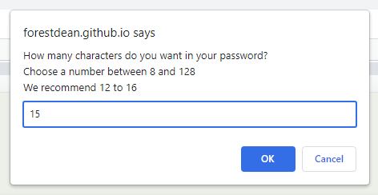
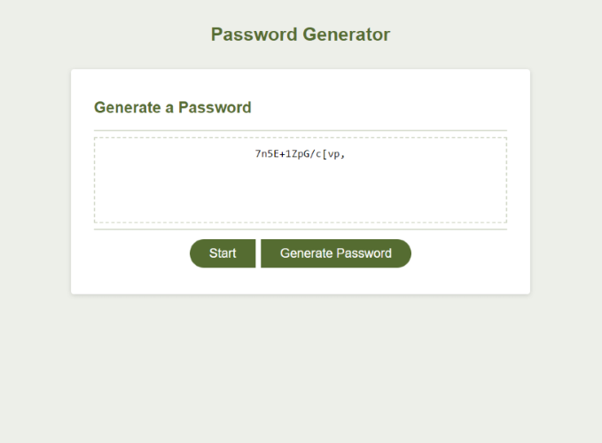
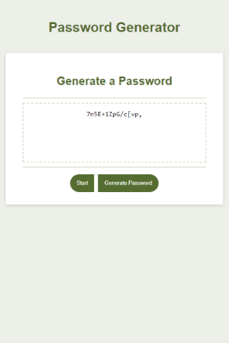

# 05-password-generator
An application designed for an employee to generate a random password.
 

## Description
	
JavaScript code has been used to query and receive selections from the user, through the browser Prompt windows.     
Those specifications are then used to assemble a random array of characters, and then display the result on the page.   
The user may then copy the result or choose to regenerate.

The **Password Generator** has been optimised for various display sizes using responsive CSS design.  
 
&nbsp;&nbsp;&nbsp;&nbsp;&nbsp;&nbsp;&nbsp;&nbsp;

	
## Installation
	
The page is live at https://forestdean.github.io/05-password-generator/
	
## Usage
	   
* Click **Start** to initiate the process.
* Enter a number between **8** and **128** in the browser **Prompt** window.
* Click **OK** then respond **Y** or **N** to the following queries...
* Click **Generate Password** to render a password to your specifications.
* Copy the password ...or click **Generate Password** again to create a new password.
	
## Credits
	
How to Find an Object by Property Value - https://www.tutorialrepublic.com/faq/how-to-find-an-object-by-property-value-in-an-array-of-javascript-objects.php 

## License
	
**MIT** - Please refer to the LICENSE in the repository.
